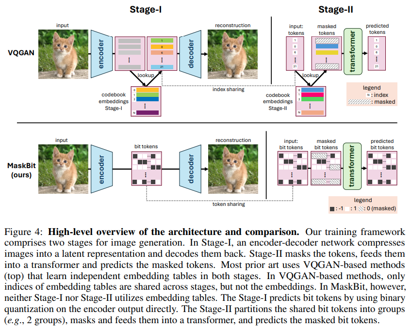

</img>

## MaskBit - Pytorch (wip)

Implementation of the proposed [MaskBit](https://arxiv.org/abs/2409.16211) from Bytedance AI

This paper can be viewed as a modernized version of the architecture from [Taming Transformers](https://arxiv.org/abs/2012.09841) from Esser et al.

They use the binary scalar quantization proposed in [MagVit2](https://arxiv.org/abs/2310.05737) in their autoencoder, and then non-autoregressive mask decoding, where the masking is setting the bit (`-1` or `+1`) to `0`, projected for the transformer without explicit embeddings for the trit

## Usage

```python
import torch
from maskbit_pytorch import BQVAE, MaskBit

images = torch.randn(1, 3, 64, 64)

# train vae

vae = BQVAE(
    image_size = 64,
    dim = 512
)

loss = vae(images, return_loss = True)
loss.backward()

# train maskbit

maskbit = MaskBit(
    vae,
    dim = 512,
    bits_group_size = 512,
    depth = 2
)

loss = maskbit(images)
loss.backward()

# after much training

sampled_image = maskbit.sample() # (1, 3, 64, 64)
```

## Citations

```bibtex
@inproceedings{Weber2024MaskBitEI,
    title   = {MaskBit: Embedding-free Image Generation via Bit Tokens},
    author  = {Mark Weber and Lijun Yu and Qihang Yu and Xueqing Deng and Xiaohui Shen and Daniel Cremers and Liang-Chieh Chen},
    year    = {2024},
    url     = {https://api.semanticscholar.org/CorpusID:272832013}
}
```
